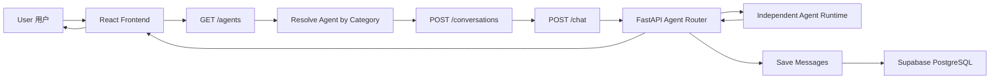
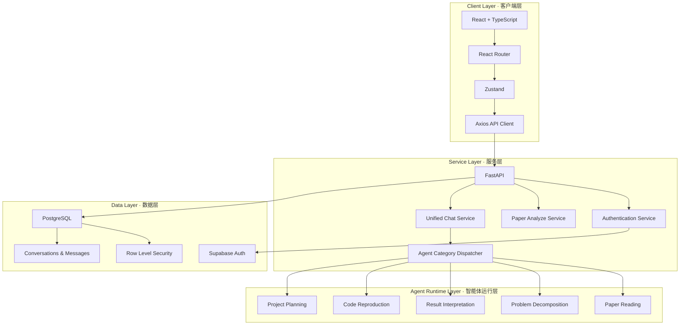
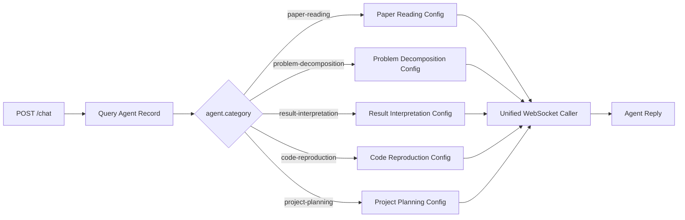
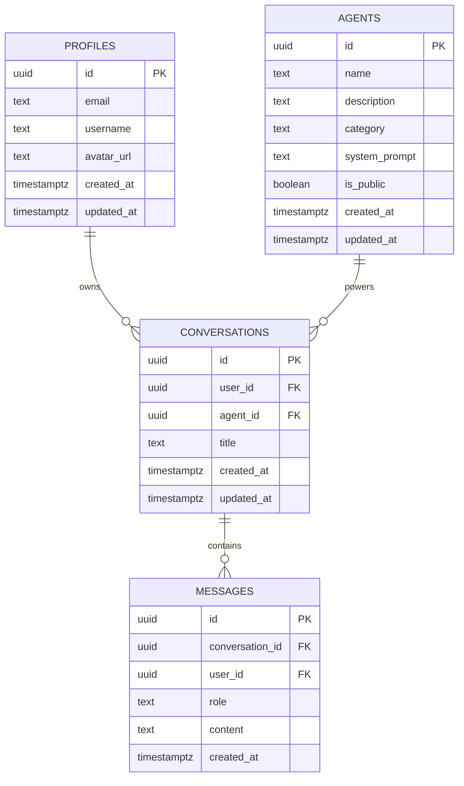
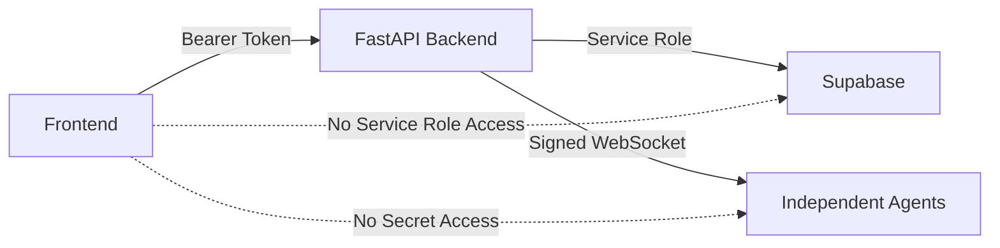
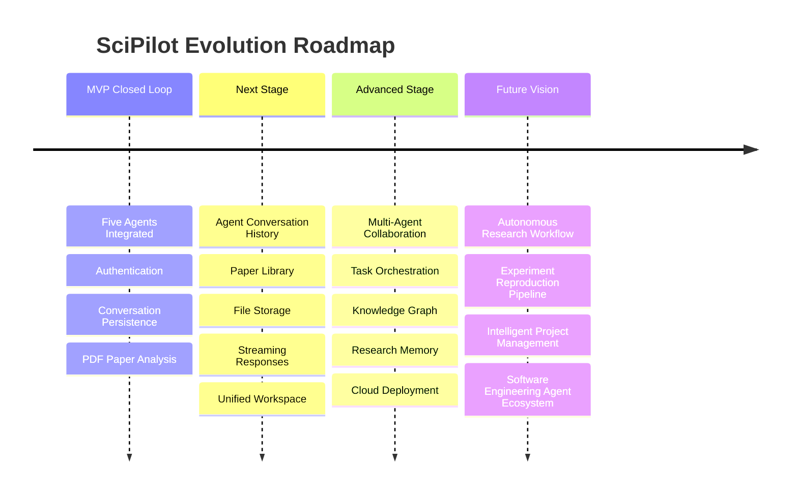

<div align="center">


<br/>


<br/><br/>


<br/><br/>


<br/>

### 面向软件工程科研场景的多智能体协同平台  
### Multi-Agent Research Copilot for Software Engineering

</div>

---

## 🌌 Project Overview · 项目概览

**SciPilot** 是一个面向软件工程学习、科研分析与项目实践的 AI Research Agent Platform。

平台将论文解析、研究问题拆解、实验结果分析、代码复现指导与项目路线规划整合到统一工作流中，并通过 **React + FastAPI + Supabase + 独立 Agent Runtime** 构建完整的前后端闭环。

> SciPilot is not a general-purpose chatbot.  
> 它不是普通聊天工具，而是面向真实科研任务的智能工程工作台。

---

## ⚡ Five-Agent Matrix · 五大核心智能体

<table>
<tr>
<td width="50%" valign="top">

### 📄 Paper Reading Agent  
### 论文精读助手

- PDF 论文上传与文本提取
- 研究背景与核心问题识别
- 方法、实验与结论结构化分析
- 基于当前论文上下文持续追问
- 支持重新上传与切换论文

**Category**

```text
paper-reading
```

</td>
<td width="50%" valign="top">

### 🧩 Problem Decomposition Agent  
### 问题拆解助手

- 将复杂研究方向拆解为可执行问题
- 分析目标、约束、输入与输出
- 提炼核心难点与关键子任务
- 生成分阶段研究与实现路径
- 适用于课题分析与需求拆解

**Category**

```text
problem-decomposition
```

</td>
</tr>

<tr>
<td width="50%" valign="top">

### 📊 Result Interpretation Agent  
### 结果分析助手

- CSV、JSON、Excel 等结果分析
- 指标含义与变化趋势解释
- 模型对比与异常现象定位
- 分析结论边界与实验可信度
- 输出改进方向与验证建议

**Category**

```text
result-interpretation
```

</td>
<td width="50%" valign="top">

### 🧬 Code Reproduction Agent  
### 代码复现助手

- GitHub 仓库复现路线规划
- Python 环境与依赖配置
- 项目模块、配置文件与入口分析
- 运行日志和错误信息诊断
- 生成可执行的复现步骤

**Category**

```text
code-reproduction
```

</td>
</tr>

<tr>
<td colspan="2" valign="top">

### 🚀 Project Planning Agent · 项目规划助手

- 将项目目标转化为完整技术路线
- 拆分需求、开发、测试与部署阶段
- 规划阶段任务、里程碑与验收标准
- 分析人员分工、风险与依赖关系
- 适用于科研项目、软件工程项目和竞赛规划

**Category**

```text
project-planning
```

</td>
</tr>
</table>

---

## 🔄 Unified Agent Workflow · 统一调用闭环



每个 Agent 均复用统一业务链路：

```text
页面加载
  ↓
根据 category 获取 agent_id
  ↓
创建 Conversation
  ↓
发送 POST /chat
  ↓
后端选择对应 Agent 配置
  ↓
调用独立 WebSocket Agent
  ↓
返回 Reply
  ↓
保存 User / Assistant Messages
```

---

## 🏗️ System Architecture · 系统架构



---

## ✨ Core Capabilities · 核心能力

| Capability | Description | Status |
|---|---|---|
| User Authentication | Supabase Auth 用户注册、登录与 Token 鉴权 | ✅ Integrated |
| Agent Discovery | 根据 category 动态获取对应 Agent | ✅ Integrated |
| Conversation Management | 创建、查询和管理用户会话 | ✅ Integrated |
| Message Persistence | 保存 user / assistant 消息 | ✅ Integrated |
| PDF Analysis | PDF 上传、解析与结构化精读 | ✅ Integrated |
| Contextual Paper Q&A | 基于当前论文内容持续追问 | ✅ Integrated |
| Problem Decomposition | 研究问题结构化拆解 | ✅ Integrated |
| Result Interpretation | 实验数据与模型结果分析 | ✅ Integrated |
| Code Reproduction | 仓库复现、环境配置与报错诊断 | ✅ Integrated |
| Project Planning | 技术路线、里程碑与风险规划 | ✅ Integrated |
| Independent Agent Config | 每个 Agent 支持独立平台配置 | ✅ Integrated |
| RLS Data Isolation | 用户数据权限隔离 | ✅ Enabled |

---

## 🧠 Agent Dispatch Strategy · 智能体调度策略

FastAPI 后端根据 Supabase `agents.category` 选择对应运行配置：



前端只接触平台业务接口，不接触：

```text
APP ID
API Key
API Secret
WebSocket URL
Assistant ID
Service Role Key
```

---

## ⚙️ Technology Stack · 技术栈

| Layer | Technologies |
|---|---|
| Frontend | React, TypeScript, Vite, Tailwind CSS |
| State & Routing | Zustand, React Router |
| HTTP Client | Axios |
| Backend | Python, FastAPI, Uvicorn, Pydantic |
| Authentication | Supabase Auth |
| Database | Supabase PostgreSQL |
| Authorization | Row Level Security |
| Document Processing | PyPDF / PDF Text Extraction |
| Agent Communication | Authenticated WebSocket |
| Version Control | Git, GitHub |

---

## 🔌 API Overview · 接口概览

| Method | Endpoint | Description |
|---|---|---|
| `GET` | `/` | 服务健康检查 |
| `POST` | `/auth/login` | 用户登录 |
| `POST` | `/auth/register` | 用户注册 |
| `GET` | `/users/me` | 获取当前用户 |
| `GET` | `/agents` | 获取公开智能体 |
| `POST` | `/conversations` | 创建会话 |
| `GET` | `/conversations` | 查询会话列表 |
| `GET` | `/conversations/{conversation_id}/messages` | 查询会话消息 |
| `POST` | `/chat` | 统一 Agent 对话接口 |
| `POST` | `/papers/analyze` | PDF 解析与论文精读 |

### Unified Chat Request

```json
{
  "conversation_id": "conversation_uuid",
  "agent_id": "agent_uuid",
  "message": "用户输入内容"
}
```

### Unified Chat Response

```json
{
  "reply": "智能体生成的回复"
}
```

---

## 🗂️ Database Model · 数据模型



---

## 📁 Project Structure · 项目结构

```text
SciPilot
├── Agent
│   ├── PaperReading.md
│   ├── ProjectPlanning.md
│   └── ...
│
├── backend
│   ├── main.py
│   ├── requirements.txt
│   ├── .env.example
│   └── services
│       ├── supabase_service.py
│       ├── llm_service.py
│       └── xunfei_agent_service.py
│
├── frontend
│   ├── public
│   ├── src
│   │   ├── components
│   │   │   ├── AgentChatPanel.tsx
│   │   │   └── NotificationContainer.tsx
│   │   ├── pages
│   │   ├── services
│   │   │   └── api.ts
│   │   ├── store
│   │   └── main.tsx
│   ├── package.json
│   ├── vite.config.ts
│   └── .env.example
│
├── supabase
│   └── migrations
│       ├── 001_init_schema.sql
│       ├── 002_updated_at_trigger.sql
│       ├── 003_rls_policies.sql
│       ├── 004_add_multi_agents.sql
│       └── 005_add_project_planning_agent.sql
│
├── docs
├── .gitignore
└── README.md
```

---

<details>
<summary><strong>🖥️ Local Development · 本地运行</strong></summary>

<br/>

### 1. Clone Repository

```bash
git clone https://github.com/telitor/SciPilot.git
cd SciPilot
```

### 2. Backend Setup

```powershell
cd backend
python -m venv .venv
.\.venv\Scripts\Activate.ps1
pip install -r requirements.txt
copy .env.example .env
python -m uvicorn main:app --reload
```

Backend API：

```text
http://localhost:8000
```

Swagger：

```text
http://localhost:8000/docs
```

### 3. Frontend Setup

```powershell
cd frontend
npm install
copy .env.example .env
npm run dev
```

Frontend：

```text
http://localhost:5173
```

</details>

---

<details>
<summary><strong>🔐 Environment Variables · 环境变量</strong></summary>

<br/>

所有真实密钥只允许写入：

```text
backend/.env
```

示例结构：

```env
# Supabase
SUPABASE_URL=your_supabase_url
SUPABASE_ANON_KEY=your_supabase_anon_key
SUPABASE_SERVICE_ROLE_KEY=your_service_role_key

# Paper Reading Agent
XF_AGENT_APP_ID=your_app_id
XF_AGENT_API_KEY=your_api_key
XF_AGENT_API_SECRET=your_api_secret
XF_AGENT_ASSISTANT_ID=your_assistant_id

# Problem Decomposition Agent
PROBLEM_DECOMPOSITION_APP_ID=your_app_id
PROBLEM_DECOMPOSITION_API_KEY=your_api_key
PROBLEM_DECOMPOSITION_API_SECRET=your_api_secret
PROBLEM_DECOMPOSITION_WS_URL=wss://your_websocket_url

# Result Interpretation Agent
RESULT_INTERPRETATION_APP_ID=your_app_id
RESULT_INTERPRETATION_API_KEY=your_api_key
RESULT_INTERPRETATION_API_SECRET=your_api_secret
RESULT_INTERPRETATION_WS_URL=wss://your_websocket_url

# Code Reproduction Agent
CODE_REPRODUCTION_APP_ID=your_app_id
CODE_REPRODUCTION_API_KEY=your_api_key
CODE_REPRODUCTION_API_SECRET=your_api_secret
CODE_REPRODUCTION_WS_URL=wss://your_websocket_url

# Project Planning Agent
PROJECT_PLANNING_APP_ID=your_app_id
PROJECT_PLANNING_API_KEY=your_api_key
PROJECT_PLANNING_API_SECRET=your_api_secret
PROJECT_PLANNING_WS_URL=wss://your_websocket_url
```

前端仅使用：

```env
VITE_API_BASE_URL=http://localhost:8000
VITE_SUPABASE_URL=your_supabase_url
VITE_SUPABASE_ANON_KEY=your_anon_key
```

</details>

---

## 🛡️ Security Architecture · 安全架构



- 前端不保存 Agent 密钥
- 前端不保存 Supabase Service Role Key
- Agent 请求统一由 FastAPI 代理
- `.env` 文件不提交至 GitHub
- Supabase RLS 隔离用户数据
- WebSocket 鉴权在服务端完成

---

## 🧪 MVP Verification · 闭环验证

```text
✅ 用户注册与登录
✅ Token 鉴权
✅ Agent 动态发现
✅ 会话创建
✅ 消息持久化
✅ PDF 上传与解析
✅ 论文结构化精读
✅ 基于论文上下文问答
✅ 问题拆解 Agent
✅ 结果分析 Agent
✅ 代码复现 Agent
✅ 项目规划 Agent
✅ 独立 Agent 配置
✅ 统一 /chat 调度
✅ 前端构建通过
✅ 本地全链路运行
```

---

## 🧭 Roadmap · 发展路线



---

## 🌠 Vision · 项目愿景

SciPilot 致力于构建一个真正服务于软件工程学习者、科研初学者与开发团队的智能科研工作台。

从阅读一篇论文开始，逐步连接：

```text
Paper Reading
    ↓
Problem Decomposition
    ↓
Result Interpretation
    ↓
Code Reproduction
    ↓
Project Planning
    ↓
Intelligent Research Workflow
```

我们的目标不仅是让 AI 回答问题，更是让 AI 参与真实科研与软件工程任务的组织、执行与沉淀。

---

## 👥 Contributors · 项目贡献者

<div align="center">

<a href="https://github.com/telitor/SciPilot/graphs/contributors">
  
</a>

</div>

---

<div align="center">


### 🚀 SciPilot · AI Research Engineering Copilot

**Five Agents. One Platform. Infinite Research Possibilities.**

<sub>From intelligent analysis to executable research workflows.</sub>

</div>
